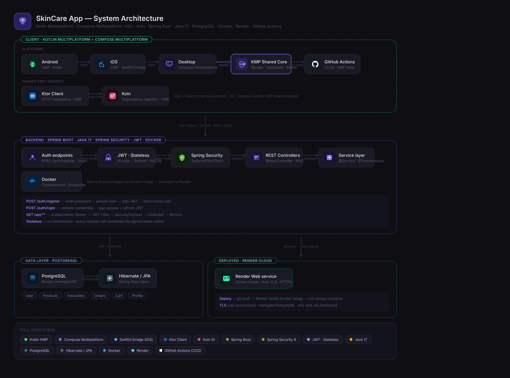

<div align="center">

# 🧴 Glow — Backend API for Skincare App

**Production-ready REST API for a Kotlin Multiplatform skincare e-commerce application**

[](https://openjdk.org/projects/jdk/17/)
[](https://spring.io/projects/spring-boot)
[](https://www.postgresql.org/)
[](https://www.docker.com/)
[](https://render.com/)
[](https://github.com/features/actions)
[](https://kotlinlang.org/docs/multiplatform.html)

</div>

---


---

## 🚀 Overview

Glow is a **scalable backend system** supporting a cross-platform skincare app (Android · iOS · Desktop).
It handles authentication, product catalogue, cart, orders, and payments using a **clean layered architecture** and *
*stateless JWT security**.

---

## 🌐 Live API

> **Base URL:** `https://YOUR_RENDER_URL.onrender.com`

> [!IMPORTANT]
> This API runs on Render free tier and **spins down after inactivity**.
> Open the app and hit **Test** or visit the link below in your browser first — this wakes the server and allocates
> resources. Takes around **60 seconds** on cold start. All requests after that are fast.

### ⚡ Wake Server

👉 `https://YOUR_RENDER_URL.onrender.com/api/auth/test`

---

## 🛠️ Tech Stack

| Layer      | Technology                        |
|------------|-----------------------------------|
| Language   | Java 17                           |
| Framework  | Spring Boot 3                     |
| Security   | Spring Security · JWT (Stateless) |
| ORM        | Hibernate · JPA                   |
| Database   | PostgreSQL                        |
| Client     | Kotlin Multiplatform (KMP)        |
| Container  | Docker                            |
| Deployment | Render                            |
| CI/CD      | GitHub Actions                    |

---

## ✨ Features

* Stateless JWT authentication (Access + Refresh)
* Role-based authorization (`USER`, `ADMIN`)
* Product catalogue with pagination, filtering, search
* Cart + checkout system
* Favourites system
* Order lifecycle management
* Simulated payment system
* Global exception handling with structured responses
* Dockerized deployment

---

## 📡 API Endpoints

All protected routes require:

```
Authorization: Bearer <access_token>
```

---

### 🔑 Auth — `/api/auth`

| Method | Endpoint    | Auth     | Description                |
|--------|-------------|----------|----------------------------|
| `GET`  | `/test`     | Public   | Health check / wake server |
| `POST` | `/signup`   | Public   | Register user              |
| `POST` | `/login`    | Public   | Login → returns tokens     |
| `POST` | `/refresh`  | Public   | Refresh access token       |
| `GET`  | `/allusers` | 🔑 Admin | Get all users              |

---

### 👤 User — `/api/user`

| Method | Endpoint | Auth   | Description    |
|--------|----------|--------|----------------|
| `GET`  | `/`      | 🔐 JWT | Get profile    |
| `PUT`  | `/`      | 🔐 JWT | Update profile |

---

### 📦 Products — `/api/products`

| Method   | Endpoint               | Auth     | Description                         |
|----------|------------------------|----------|-------------------------------------|
| `GET`    | `/`                    | Public   | All products (pagination + filters) |
| `GET`    | `/search`              | Public   | Search products                     |
| `GET`    | `/{id}`                | Public   | Get product by ID                   |
| `GET`    | `/categories`          | Public   | All categories                      |
| `GET`    | `/category/{category}` | Public   | Products by category                |
| `POST`   | `/`                    | 🔑 Admin | Add product                         |
| `PUT`    | `/{id}`                | 🔑 Admin | Update product                      |
| `DELETE` | `/{id}`                | 🔑 Admin | Delete product                      |

---

### 🛒 Cart — `/api/cart`

| Method   | Endpoint       | Auth   | Description      |
|----------|----------------|--------|------------------|
| `POST`   | `/`            | 🔐 JWT | Add to cart      |
| `GET`    | `/`            | 🔐 JWT | Get cart         |
| `DELETE` | `/{productId}` | 🔐 JWT | Remove item      |
| `GET`    | `/all`         | 🔐 JWT | All items        |
| `GET`    | `/checkout`    | 🔐 JWT | Checkout summary |

---

### ❤️ Favourites — `/api/favourites`

| Method | Endpoint       | Auth   | Description      |
|--------|----------------|--------|------------------|
| `GET`  | `/`            | 🔐 JWT | Get favourites   |
| `GET`  | `/{productId}` | 🔐 JWT | Check favourite  |
| `POST` | `/{productId}` | 🔐 JWT | Toggle favourite |

---

### 🧾 Orders — `/api/order`

| Method   | Endpoint            | Auth     | Description   |
|----------|---------------------|----------|---------------|
| `POST`   | `/`                 | 🔐 JWT   | Create order  |
| `GET`    | `/`                 | 🔐 JWT   | Get orders    |
| `PATCH`  | `/{orderId}/status` | 🔐 JWT   | Update status |
| `DELETE` | `/{orderId}`        | 🔑 Admin | Delete order  |

---

### 💳 Payment — `/api/payment`

| Method | Endpoint         | Auth   | Description      |
|--------|------------------|--------|------------------|
| `POST` | `/{orderId}/pay` | 🔐 JWT | Simulate payment |

---

## ⚠️ Error Handling

All errors return a consistent structured response via `@RestControllerAdvice`:

```json
{
  "status": 404,
  "code": "RESOURCE_NOT_FOUND",
  "message": "Product not found",
  "path": "/api/products/42",
  "timestamp": "2024-01-15T10:30:00"
}
```

| Exception                                | Code                  | HTTP Status              |
|------------------------------------------|-----------------------|--------------------------|
| `UserNotFoundException`                  | `USER_NOT_FOUND`      | `404 Not Found`          |
| `UserAlreadyExistedException`            | `USER_ALREADY_EXISTS` | `409 Conflict`           |
| `InvalidPasswordException`               | `UNAUTHORIZED`        | `401 Unauthorized`       |
| `InvalidTokenException`                  | `UNAUTHORIZED`        | `401 Unauthorized`       |
| `TokenExpiredException`                  | `UNAUTHORIZED`        | `401 Unauthorized`       |
| `UnauthorizedActionException`            | `FORBIDDEN`           | `403 Forbidden`          |
| `ProductNotFoundException`               | `RESOURCE_NOT_FOUND`  | `404 Not Found`          |
| `ResourceNotFoundException`              | `RESOURCE_NOT_FOUND`  | `404 Not Found`          |
| `NoHandlerFoundException`                | `ENDPOINT_NOT_FOUND`  | `404 Not Found`          |
| `HttpRequestMethodNotSupportedException` | `METHOD_NOT_ALLOWED`  | `405 Method Not Allowed` |
| `AuthenticationException`                | `AUTH_REQUIRED`       | `401 Unauthorized`       |
| `AccessDeniedException`                  | `ACCESS_DENIED`       | `403 Forbidden`          |

> **Security layer:** `401` and `403` responses for missing or invalid JWT tokens are handled directly in
`SecurityFilterChain` via a custom `authenticationEntryPoint` and `accessDeniedHandler` — before the request ever
> reaches a controller.

---

## ⚙️ CI/CD

GitHub Actions pipeline:

* Backend build + tests (Maven)
* Ensures API stability on every push
* Ready for Docker build + deployment

---

## 🐳 Run Locally

```bash
git clone https://github.com/atharvyadav22/glow-backend.git
cd glow-backend
```

Configure `application.properties` or set as environment variables:

```properties
spring.datasource.url=jdbc:postgresql://localhost:5432/glow
spring.datasource.username=YOUR_DB_USER
spring.datasource.password=YOUR_DB_PASSWORD
spring.jpa.hibernate.ddl-auto=update
jwt.secret=YOUR_256_BIT_SECRET
jwt.access-expiry=900000
jwt.refresh-expiry=604800000
```

**With Maven:**

```bash
./mvnw spring-boot:run
```

**With Docker:**

```bash
docker build -t glow-backend .
docker run -p 8080:8080 glow-backend
```

---

<div align="center">

Made with ❤️ by **AY彡STUDIOS**

</div>