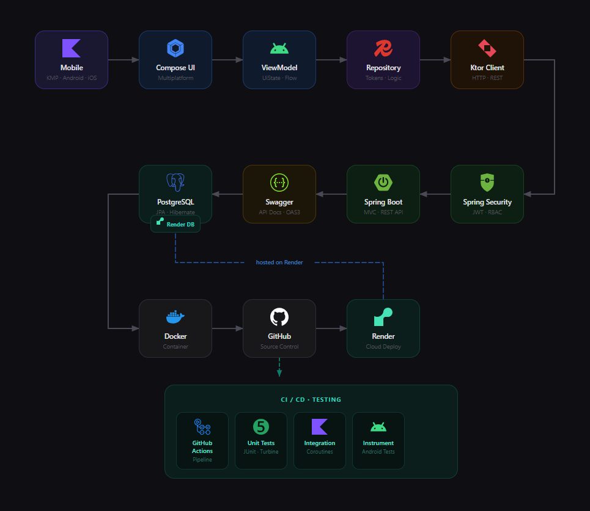
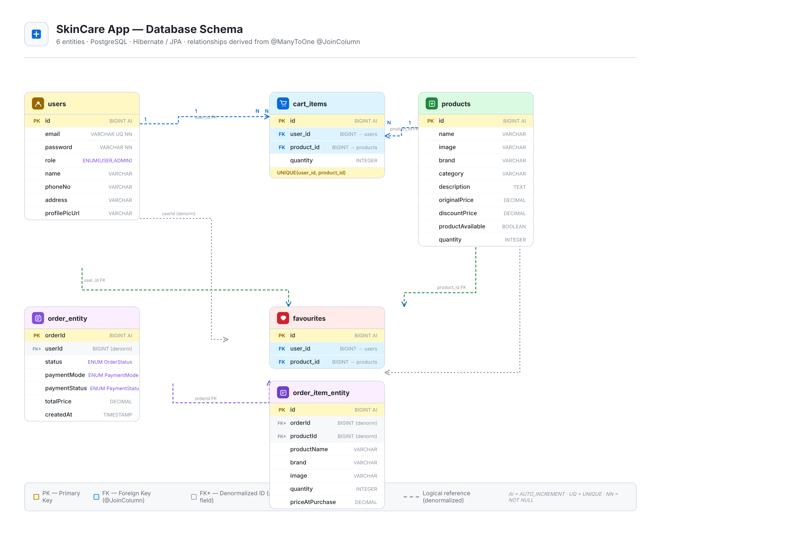

# 🧴 Glow — Backend API

### 🚀 Production-Ready Spring Boot • Scalable • Stateless Architecture

> Backend system powering a cross-platform Kotlin Multiplatform commerce application

---
## 🧠 Architecture



---

## 🩻 Schema



---

## ⚡ Highlights

| Feature         | Description                                 |
| --------------- | ------------------------------------------- |
| 🔐 Auth         | Stateless JWT (Access + Refresh)            |
| 🛡️ Security    | Role-based (USER / ADMIN)                   |
| 🧱 Architecture | Layered (Controller → Service → Repository) |
| 📡 API          | 30+ REST endpoints                          |
| 🔍 Query        | Pagination · Filtering · Search             |
| ⚠️ Errors       | Global exception handling                   |
| 🗄️ DB          | PostgreSQL + JPA (Hibernate)                |
| ⚙️ Infra        | Docker + Render deployment                  |
| 🔁 CI/CD        | GitHub Actions pipeline                     |

---

## 📊 Scope

* Auth · Products · Cart · Orders · Payment
* Structured API responses
* Stateless scalable design

---

## 🛠️ Tech Stack

| Layer      | Tech                  |
| ---------- | --------------------- |
| Language   | Java 17               |
| Framework  | Spring Boot 3         |
| Security   | Spring Security + JWT |
| ORM        | Hibernate · JPA       |
| Database   | PostgreSQL            |
| Deployment | Render                |
| Container  | Docker                |
| CI/CD      | GitHub Actions        |

---

## 🌐 Live API

### 🔗 Access

| Service    | Link                                                      |
| ---------- | --------------------------------------------------------- |
| 🌐 Backend | https://glow-backend-1.onrender.com                       |
| 📄 Swagger | https://glow-backend-1.onrender.com/swagger-ui/index.html |
| ⚡ Wake     | https://glow-backend-1.onrender.com/api/auth/test         |

⚠️ First request may take ~60 seconds (Render cold start)

---

## 🚀 Usage

### 🔹 Production

→ Use deployed API
→ Hit `/api/auth/test` if cold

---

### 🔹 Local (Maven)

```bash
./mvnw spring-boot:run
```

---

### 🔹 Docker (Recommended)

```bash
# clone
git clone https://github.com/atharvyadav22/glow-backend.git
cd glow-backend

# build image
docker build -t glow-backend .

# run container
docker run -p 8080:8080 glow-backend
```

---

### 🔹 Config

```properties
spring.datasource.url=jdbc:postgresql://localhost:5432/glow
spring.datasource.username=YOUR_DB_USER
spring.datasource.password=YOUR_DB_PASSWORD
```

---

## 🔗 Full Stack

* 📱 KMP App: https://github.com/atharvyadav22/Skincare
* ⚙️ Backend: This repository

---

<div align="center">
Made with ❤️ by AY彡STUDIOS
</div>